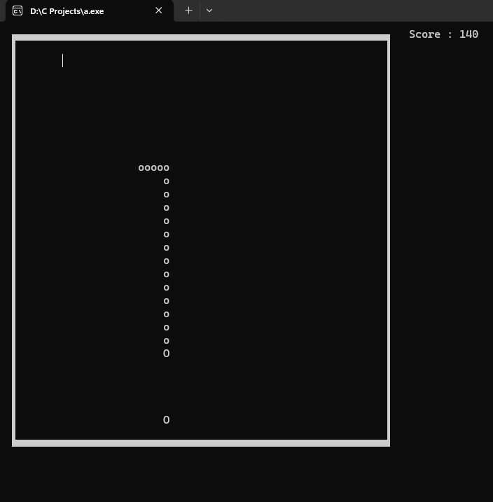
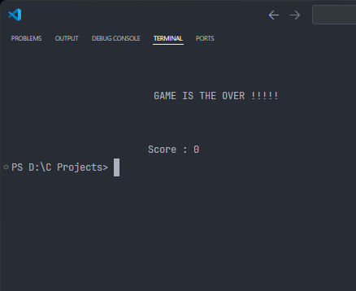

# 🐍 Snake Game in C

## 📌 Overview

This project is a **console-based Snake Game** developed using the **C programming language**. The player controls a snake inside a square game boundary and collects fruits to increase the snake's length and score.

The snake can be controlled using the **W, A, S, and D keys** to move in four directions. If the snake crosses the boundary of the game box, it will reappear from the **opposite side of the box**, creating a continuous gameplay experience.

The game ends when the snake **collides with itself**.

This project demonstrates key programming concepts such as **game loops, keyboard input handling, collision detection, and dynamic movement logic**.

---

## 🚀 Features

* Console-based **interactive Snake Game**
* Control the snake using **W, A, S, D keys**
* **Fruit collection system** to increase score
* Snake **length increases** when fruit is eaten
* **High score tracking**
* Snake **wraps around the boundary** (appears on the opposite side)
* **Game Over detection**

---

## 🎮 Controls

| Key | Action     |
| --- | ---------- |
| W   | Move Up    |
| A   | Move Left  |
| S   | Move Down  |
| D   | Move Right |

---

## 🛠️ Technologies Used

* **C Programming Language**
* Standard C Libraries
* Console Input/Output

---

## 📂 Project Structure

snake-game-c 
│
├── screenshots
├── README.md
└── Snake_Game.c

---

## ▶️ How to Run the Game

### 1️⃣ Compile the program

```bash
gcc Snake_Game.c -o Snake_Game
```

### 2️⃣ Run the program

```bash
./Snake_Game
```

### 3️⃣ Control the snake using

```
W A S D keys
```

Collect fruits and avoid colliding with yourself.

---

## 🖥️ Game Screenshots

### 🎮 Start Game Screen


---

### 🏆 Gameplay with Score and Snake Length



---

### 💀 Game Over Screen



---

## 🎯 Learning Outcomes

Through this project I learned:

* Game loop implementation in C
* Handling keyboard inputs
* Collision detection
* Dynamic object movement
* Console-based UI design

---

## 🔮 Future Improvements

* Add **color graphics for snake and fruit**
* Add **difficulty levels**
* Implement **pause/resume functionality**
* Store **high scores in a file**

---

## 👨‍💻 Author

**Kesavan**

Aspiring **Frontend Developer** passionate about building software and learning new technologies.
